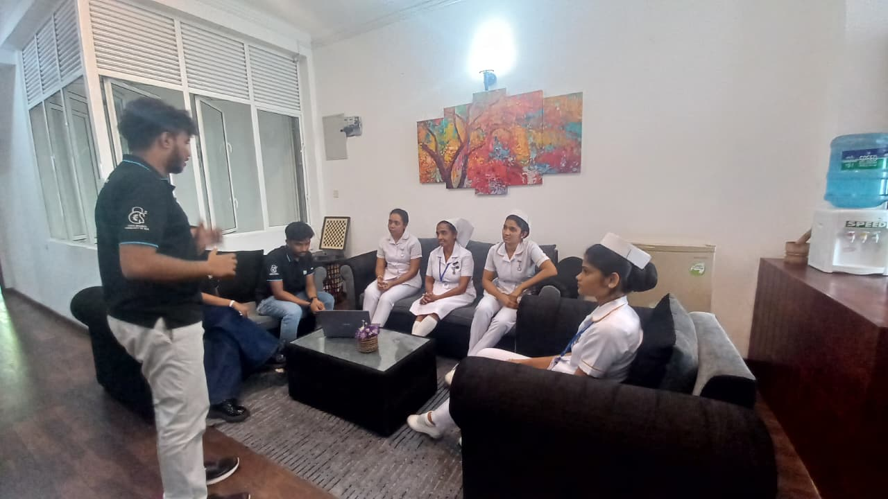

<h1 align="center">🏥 Winlanka Hospital Security Risk Assessment</h1>

  

🔐 OCTAVE Allegro • NIST Cybersecurity Framework • Healthcare Risk Management

<h2>📌 Overview</h2>

This project presents an information security risk assessment for Winlanka Hospital, a private healthcare institution in Sri Lanka. 
The assessment applies the <b>OCTAVE Allegro</b> methodology and is supported by the <b>NIST Cybersecurity Framework</b> to identify critical assets, evaluate threats and vulnerabilities, and recommend practical mitigation strategies.

<h2>🏥 Hospital Context</h2>

Winlanka Hospital is a mid-sized healthcare facility with approximately <b>165 staff members</b>, relying on digital systems such as the 
<b>Hospital Information System (HIS)</b>, internal network infrastructure, communication systems, backup platforms, and physical security technologies. 
Because of the sensitivity of patient and operational data, maintaining confidentiality, integrity, and availability is essential.

<h2>🛠️ Assessment Approach</h2>

<ul>
<li>📋 Risk assessment using <b>OCTAVE Allegro</b></li>
<li>🧩 Mapping recommendations to the <b>NIST Cybersecurity Framework</b></li>
<li>🏥 Focus on healthcare-specific cybersecurity risks</li>
<li>📑 Asset profiling, vulnerability identification, and mitigation planning</li>
<li>📊 Risk evaluation using Worksheet 8 and Worksheet 10</li>
</ul>

<h2>🔍 Critical Assets Identified</h2>

<ul>
<li>🏥 Hospital Information System (HIS)</li>
<li>🌐 Internal Network Infrastructure (Switches, Routers, VLANs, Firewalls)</li>
<li>💾 Backup and Disaster Recovery Systems</li>
<li>📧 Communication Platforms (Email, Paging)</li>
<li>🎥 Physical Security Systems (CCTV, RFID Access)</li>
</ul>

<i>These assets were identified as essential to hospital operations and patient safety.</i>

<h2>⚠️ Key Security Issues Identified</h2>

<ul>
<li>Lack of Multi-Factor Authentication (MFA)</li>
<li>Inadequate network segmentation</li>
<li>Weak backup validation and disaster recovery testing</li>
<li>Insufficient logging and monitoring</li>
<li>Outdated CCTV and RFID access controls</li>
<li>Limited cybersecurity awareness among staff</li>
<li>Absence of a documented Incident Response Plan (IRP)</li>
</ul>

<h2>🛡️ Recommended Security Improvements</h2>

<ul>
<li>🔐 Enforce MFA for all critical systems</li>
<li>🌐 Implement VLAN-based segmentation and internal firewalls</li>
<li>💾 Automate backup validation and conduct recovery testing</li>
<li>📊 Deploy centralized logging and SIEM monitoring</li>
<li>🎥 Upgrade physical security systems with tamper detection and audit logging</li>
<li>📚 Conduct continuous cybersecurity awareness training</li>
<li>📄 Establish and test a formal Incident Response Plan (IRP)</li>
</ul>

<h2>📊 Risk Management Focus</h2>

The project evaluates how cyber risks affect:

<ul>
<li>👨‍⚕️ Patient Safety and Trust</li>
<li>⏱️ Operational Continuity</li>
<li>⚖️ Regulatory and Legal Compliance</li>
<li>💰 Financial Stability</li>
<li>🏥 Reputation and Public Confidence</li>
</ul>

<h2>🧠 Skills Demonstrated</h2>

<ul>
<li>Information Security Risk Assessment</li>
<li>OCTAVE Allegro methodology</li>
<li>NIST Cybersecurity Framework mapping</li>
<li>Healthcare cybersecurity analysis</li>
<li>Threat and vulnerability identification</li>
<li>Risk evaluation and mitigation planning</li>
<li>Technical report writing</li>
</ul>

<h2>📂 Project Report</h2>

📄 <a href="YOUR_PDF_LINK_HERE">View Full Report</a>

<h2>⚠️ Security Note</h2>

This repository contains assessment content only. No real hospital credentials, operational secrets, or sensitive patient data are included.

⭐ Academic Project | Healthcare Cybersecurity | Risk Management

